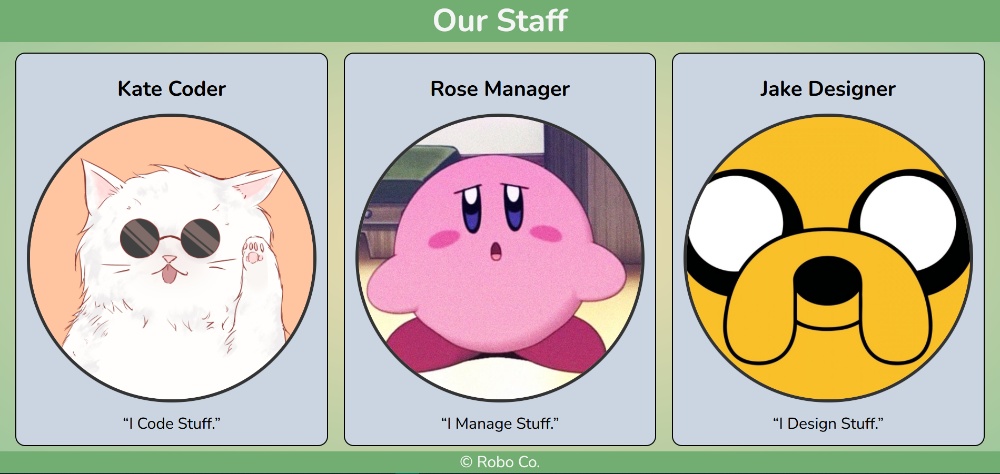

# Responsive Card Website

A simple and elegant responsive card website showcasing semantic HTML and CSS. This project demonstrates clean, accessible, and responsive design principles.

## Features

- **Semantic HTML:** Improves accessibility and readability of the code.
- **CSS Styling:** Includes responsive design techniques and smooth scroll behavior.
- **Google Fonts:** Incorporates custom typography for enhanced visual appeal.
- **Sticky Navigation:** Ensures easy access to different sections of the page.

## Challenge Details

This project was created as part of a challenge by [Dave Gray](https://www.youtube.com/@DaveGrayTeachesCode).  
His channel offers coding tutorials and challenges. Check it out!

---

## Screenshots

---

## Technologies Used

- HTML5
- CSS3
- [Google Fonts](https://fonts.google.com)

---
